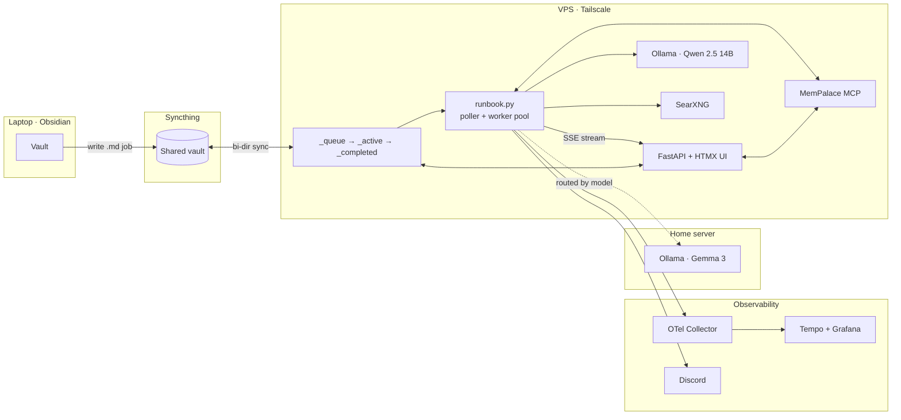

# vault-runner

> A self-hosted LLM job runner that turns an Obsidian vault into a distributed AI workbench.

Drop a Markdown file into a folder. A worker picks it up, routes it to the right model on the right machine, streams the output back into your vault, and ships a trace to Grafana. No queues, no brokers, no cloud APIs — just files, notes, and local models.

- **File-based job queue** driven from your note-taking app — every job is a `.md` file that moves through `_queue → _active → _completed`.
- **Multi-machine model routing** — a VPS runs Qwen 2.5 14B, a home server runs Gemma 3; jobs route automatically by the `model:` field.
- **MCP-integrated semantic memory** — every past output is indexed in MemPalace; new jobs can pull relevant context with one YAML flag (`use_memory: true`).
- **Full observability** — OpenTelemetry traces to Tempo/Grafana, structured job logs, Discord alerts on failure.
- **Streaming UI** — FastAPI + HTMX dashboard with live SSE output tail, job cancellation, template picker, and vault search.

---

## Architecture



See [docs/architecture.md](docs/architecture.md) for the deep dive.

---

## Screenshots

| Web UI (`control.davidcockson.com`) | Grafana / Tempo trace |
|---|---|
|  |  |

| Monitoring dashboard | Discord failure alerts |
|---|---|
|  |  |

---

## How a job flows

1. **Author** — you write a Markdown file with YAML frontmatter in `_queue/` (either by hand in Obsidian or via the web UI):
   ```markdown
   ---
   type: text
   model: qwen2.5:14b
   use_memory: true
   ---
   Summarise what my vault says about distributed consensus.
   ```
2. **Sync** — Syncthing replicates the file from laptop to VPS.
3. **Pick up** — the poller moves the file to `_active/` and spawns a worker thread.
4. **Route** — model name resolves to a runner (primary VPS or secondary home server).
5. **Enrich** — if `use_memory: true`, MemPalace injects the top-N relevant past outputs into the prompt.
6. **Execute** — Ollama streams tokens; the UI tails them live over SSE.
7. **Land** — output is written to `runner-outputs/<job-id>-output.md`, the job moves to `_completed/`, the trace lands in Tempo, and the new output is indexed back into MemPalace.

---

## Job types

| Type | What it does |
|---|---|
| `text` | Single prompt → single completion. |
| `vision` | Prompt + image → completion (multimodal models). |
| `staged` | Multi-step checklist, each step accumulates context from the last. |
| `chain` | Pre-defined pipeline of steps; each step spawns the next as its own queue file (full traceability). |
| `chain_planner` | You give a goal; an LLM generates the chain steps, then executes them. |

Full reference: [docs/job-types.md](docs/job-types.md).

---

## Tech stack

| Component | Choice | Why |
|---|---|---|
| Queue | Filesystem (`_queue → _active → _completed`) | Obsidian is already the UI; Syncthing handles replication; no broker to babysit. |
| Worker | `runbook.py` — threaded poller | Simple, debuggable, restartable. Cancellation registry lets the UI kill a running job. |
| API / UI | FastAPI + HTMX + SSE | Server-rendered HTML with live updates, no SPA build step. |
| LLMs | Ollama (local) — Qwen 2.5 14B, Gemma 3 | No per-token costs, data stays on hardware I control. |
| Memory | MemPalace (bundled in [./mempalace](mempalace/)) over MCP | Vector search over every job output + book corpus; exposed to Claude Code too. |
| Search | SearXNG (self-hosted) | Web-search step in chains without API keys. |
| Observability | OpenTelemetry → Tempo + Grafana | Every job is a trace; every LLM call is a span. |
| Transport | Tailscale + Cloudflare Tunnel | Zero-trust mesh between machines; public UI without opening ports. |
| Deploy | systemd + GitLab CI/CD on the live deployment; GitHub Actions in this repo | 76 pytest tests gate every merge. |

---

## Run it yourself

```bash
git clone https://github.com/<you>/vault-runner.git
cd vault-runner/runner
python -m venv venv && source venv/bin/activate
pip install -r requirements.txt
cp config.example.yaml config.yaml   # edit paths, models
python runbook.py &                   # start the worker
uvicorn web:app --host 0.0.0.0 --port 8000
```

Full setup (Ollama, Syncthing, systemd units, MemPalace, SearXNG, OTel) is in [docs/deployment.md](docs/deployment.md).

---

## Project status

Live in production at the time of writing, handling jobs daily across two machines. The codebase is Phase 1–5 complete:

- ✅ Phase 1 — poller + Ollama + traces + Discord alerts
- ✅ Phase 2 — multi-step & chain jobs
- ✅ Phase 3 — multi-machine routing
- ✅ Phase 4 — MemPalace integration
- ✅ Phase 5 — Web UI with streaming output

Roadmap: tool-calling / skills framework, librarian agent, research agent. See [docs/integrations.md](docs/integrations.md) for the current integration surface.

---

## Repo layout

```
vault-runner/
├── runner/             core poller, web UI, templates, tests (76 pytest)
├── mempalace/          how vault-runner consumes the MemPalace MCP store
├── vault-example/      minimal vault so you can try it immediately
└── docs/               architecture, deployment, job-types, integrations
```

---

## Built by Dave

- Production instance: `control.davidcockson.com` (private — see [screenshots](docs/screenshots))
- MIT licensed — see [LICENSE](LICENSE)
