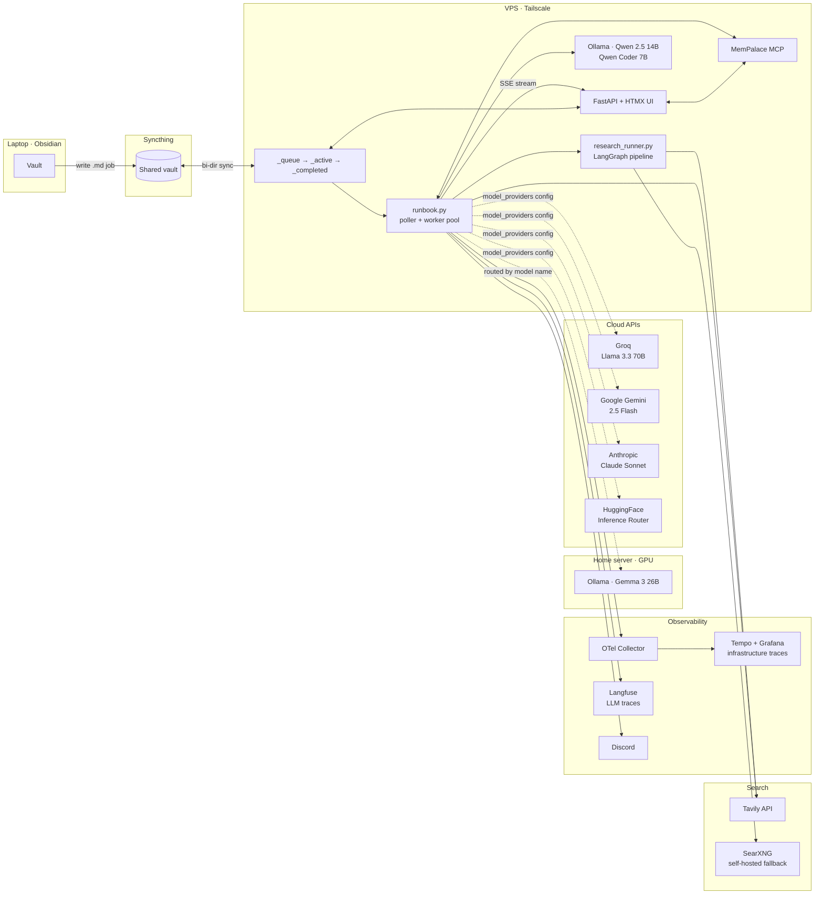
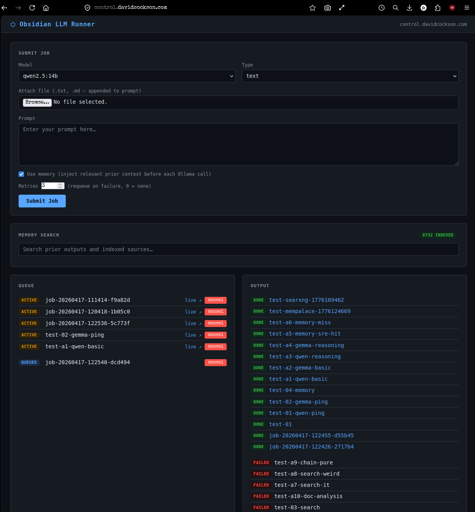
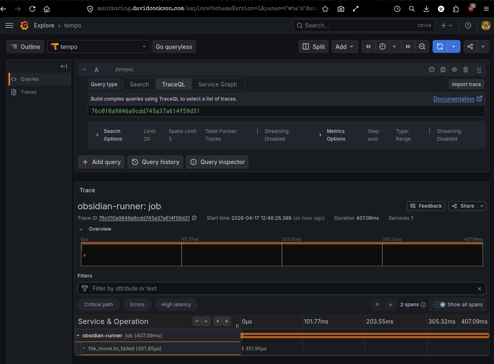
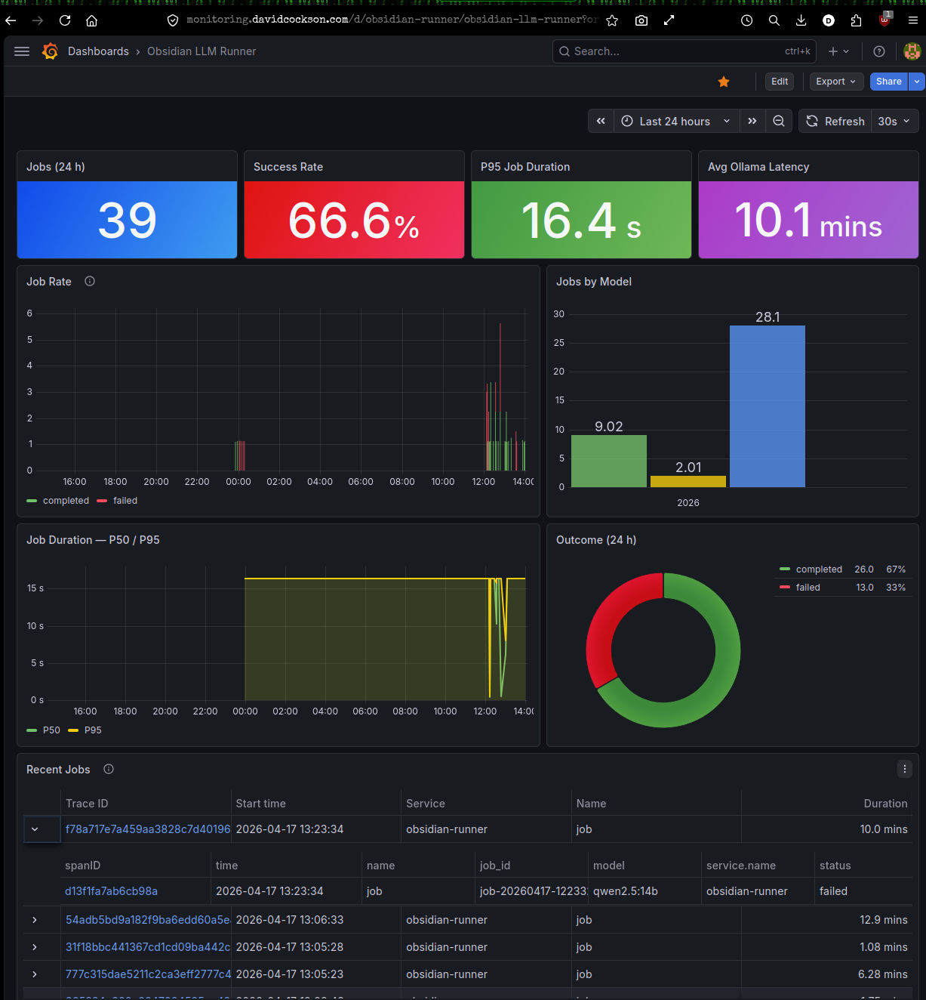
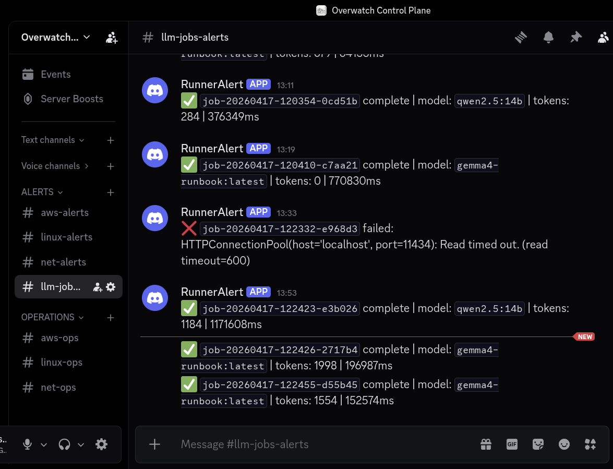

# vault-runner

> A self-hosted LLM job runner that turns an Obsidian vault into a distributed AI workbench.

Drop a Markdown file into a folder. A worker picks it up, routes it to the right model — local Ollama, Groq, Gemini, Anthropic, or HuggingFace — streams the output back into your vault, and ships a trace to both Grafana and Langfuse. No queues, no brokers, no cloud lock-in — just files, notes, and models you choose.

- **File-based job queue** driven from your note-taking app — every job is a `.md` file that moves through `_queue → _active → _completed`.
- **Multi-provider model routing** — local Ollama (Qwen, Gemma), Groq, Gemini, Anthropic, and HuggingFace in one config table; jobs route automatically by the `model:` field.
- **Agentic chain jobs** — pre-defined multi-step pipelines where each step can call a different model or trigger an action (web search, URL fetch, GitLab push, CI poll).
- **LangGraph research pipeline** — goal → parallel Tavily searches → entity/relation extraction into KuzuDB → synthesised report, all as a single job.
- **GitLab CI/CD code-gen loop** — LLM generates code → pushes to GitLab → CI runs → on failure, LLM sees the log tail and retries, up to N times.
- **Dual observability** — OpenTelemetry traces to Tempo/Grafana for infrastructure metrics, Langfuse for LLM-specific traces (prompts, completions, token counts per call).
- **MCP-integrated semantic memory** — every past output is indexed in MemPalace; new jobs pull relevant context with one YAML flag (`use_memory: smart`).
- **Streaming UI** — FastAPI + HTMX dashboard with live SSE output tail, job cancellation, template picker, and vault search.

---

## Architecture



See [docs/architecture.md](docs/architecture.md) for the deep dive.

---

## Screenshots

| Web UI (`control.davidcockson.com`) | Grafana / Tempo trace |
|---|---|
|  |  |

| Monitoring dashboard | Discord failure alerts |
|---|---|
|  |  |

---

## How a job flows

1. **Author** — write a Markdown file with YAML frontmatter in `_queue/` (by hand in Obsidian or via the web UI):
   ```markdown
   ---
   type: text
   model: llama-3.3-70b-versatile
   use_memory: smart
   ---
   Summarise what my vault says about distributed consensus.
   ```
2. **Sync** — Syncthing replicates the file from laptop to VPS within seconds.
3. **Pick up** — the poller moves the file to `_active/` and spawns a worker thread.
4. **Route** — the `model:` field is looked up in `model_providers`; if it maps to a cloud provider (Groq, Gemini, Anthropic, HuggingFace), that API is called. Otherwise, `model_runners` maps it to an Ollama instance (local VPS or home server GPU).
5. **Enrich** — if `use_memory: smart`, MemPalace generates search queries from the task and injects the top-N relevant past outputs into the prompt.
6. **Execute** — the LLM call runs; for local Ollama jobs the UI tails tokens live over SSE.
7. **Trace** — the job span lands in Tempo (latency, token counts, model); the LLM call lands in Langfuse (prompt, completion, cost estimate).
8. **Land** — output is written to `runner-outputs/<job-id>-output.md`, the job moves to `_completed/`, the output is indexed back into MemPalace, and Discord gets a completion ping.

---

## Job types

| Type | What it does |
|---|---|
| `text` | Single prompt → single completion. Streams to the UI live. |
| `vision` | Prompt + image → completion (multimodal Ollama models). |
| `staged` | Multi-step checklist; each step accumulates context from the last. One job file. |
| `chain` | Pre-defined pipeline of steps, each step a separate job file (full trace per step). Steps can mix models and actions. |
| `chain_planner` | You give a goal; the LLM generates the step list, then executes it. |
| `research` | LangGraph pipeline: parallel Tavily searches → entity/relation extraction into KuzuDB → synthesised report. |

Full reference: [docs/job-types.md](docs/job-types.md).

---

## Chain actions

Chain steps can call actions instead of (or in addition to) an LLM. This is what makes the GitLab code-gen loop and research pipeline possible:

| Action | What it does |
|---|---|
| `search` | Tavily web search; results injected as context for the next step. Falls back to SearXNG if Tavily key is absent. |
| `fetch` | Fetches a URL and extracts the main content (via `trafilatura`); result injected as context. |
| `gitlab_push` | Creates or updates a file in a GitLab repo and opens an MR from the previous step's output. |
| `gitlab_ci_poll` | Waits for the CI pipeline to go green. On failure: sends the log tail to the LLM for a fix, re-pushes, and retries up to `ci_max_retries` times. |

**Example — LLM code-gen loop:**
```yaml
---
type: chain
model: qwen2.5-coder:7b
chain:
  - prompt: "Write a Python script that parses nginx access logs and reports the top 10 IPs by request count."
    model: qwen2.5-coder:7b
  - action: gitlab_push
  - action: gitlab_ci_poll
---
```

---

## Tech stack

| Component | Choice | Why |
|---|---|---|
| Queue | Filesystem (`_queue → _active → _completed`) | Obsidian is already the UI; Syncthing handles replication; no broker to operate. |
| Worker | `runbook.py` — threaded poller | Simple, debuggable, restartable. Cancellation registry lets the UI kill in-flight jobs. |
| API / UI | FastAPI + HTMX + SSE | Server-rendered HTML with live token streaming, no SPA build step. |
| Local LLMs | Ollama — Qwen 2.5 14B / Coder 7B, Gemma 3 26B | No per-token costs; data stays on hardware I control. |
| Cloud LLMs | Groq (Llama 3.3 70B), Gemini 2.5 Flash, Anthropic Claude, HuggingFace | Routed by model name via a single config table; no code changes to switch. |
| Search | Tavily API (primary), SearXNG self-hosted (fallback) | Tavily reaches the open web from any server; SearXNG for airgapped/private search. |
| Research pipeline | LangGraph + KuzuDB | Multi-hop agentic search with entity/relation graph persistence between runs. |
| Memory | MemPalace (bundled in [./mempalace](mempalace/)) over MCP | Vector search over every job output + book corpus; queryable from Claude Code via MCP too. |
| LLM observability | Langfuse (self-hosted) | Per-call traces: prompt, completion, token counts, model, cost estimate. |
| Infra observability | OpenTelemetry → Tempo + Grafana | Job lifecycle spans, LLM call latency, success rate dashboards. |
| Transport | Tailscale + Cloudflare Tunnel | Zero-trust mesh between machines; public UI without opening firewall ports. |
| CI/CD | GitLab CI (live deployment) + GitHub Actions (this repo) | 87 pytest tests gate every merge; Bandit + pip-audit on every pipeline. |

---

## Run it yourself

```bash
git clone https://github.com/davidcockson-compliance/vault-runner.git
cd vault-runner/runner
python -m venv venv && source venv/bin/activate
pip install -r requirements.txt
cp config.example.yaml config.yaml   # edit paths, models, providers
cp .env.example .env                 # add API keys for any cloud providers you want
python runbook.py &
uvicorn web:app --host 0.0.0.0 --port 8000
```

Minimum viable setup needs only Ollama and a vault folder — cloud providers, Langfuse, GitLab integration, and Tavily are all optional and gated by config flags.

Full setup (Syncthing, systemd units, MemPalace, OTel, Langfuse) is in [docs/deployment.md](docs/deployment.md).

---

## Project status

Live in production, handling jobs daily across a VPS (Qwen 2.5 14B) and a home-lab GPU server (Gemma 3 26B), with cloud API overflow to Groq and Gemini.

- ✅ Phase 1 — file-based queue, Ollama, OTel traces, Discord alerts
- ✅ Phase 2 — multi-step staged and chain jobs
- ✅ Phase 3 — multi-machine Ollama routing with health-check failover
- ✅ Phase 4 — MemPalace semantic memory (pre-job injection + post-job indexing)
- ✅ Phase 5 — streaming web UI (FastAPI + HTMX + SSE), job cancellation, template picker
- ✅ Phase 6 — multi-cloud provider routing (Groq, Gemini, Anthropic, HuggingFace)
- ✅ Phase 7 — GitLab CI/CD code-gen loop (generate → push → CI → LLM fix on failure → retry)
- ✅ Phase 8 — Langfuse LLM tracing; Tavily search replacing SearXNG as primary
- ✅ Phase 9 — LangGraph research pipeline with KuzuDB knowledge graph

Roadmap: tool-calling / skills framework, job scheduling (`run_at:` frontmatter), parallel chain steps, resume-from-checkpoint on crash.

---

## Repo layout

```
vault-runner/
├── runner/             core poller (runbook.py), web UI, research pipeline, tests (87 pytest)
├── mempalace/          MemPalace MCP server consumed by vault-runner and Claude Code
├── vault-example/      minimal vault so you can try it immediately
└── docs/               architecture, deployment, job-types, integrations
```

---

## Built by Dave

- Production instance: `control.davidcockson.com` (private — see [screenshots](docs/screenshots))
- MIT licensed — see [LICENSE](LICENSE)
