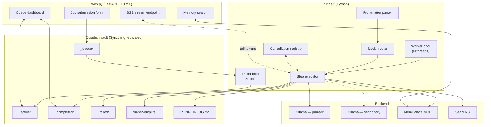
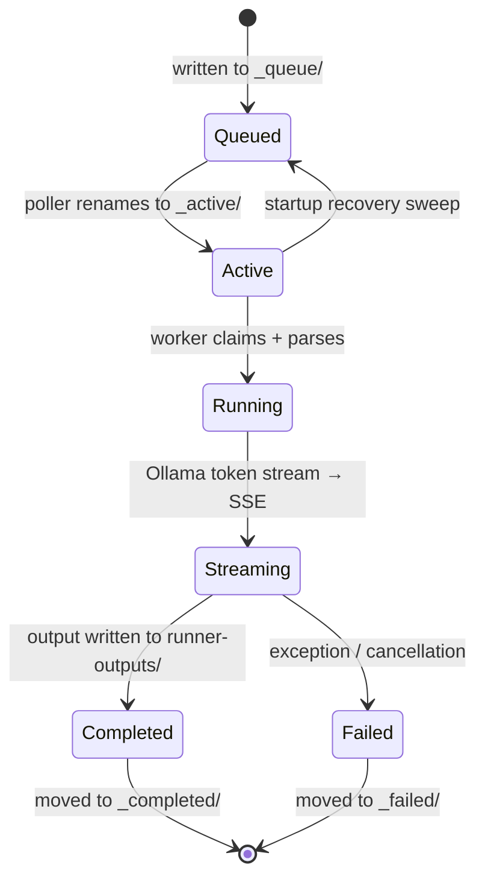

# Architecture

vault-runner is a file-driven job system. The Obsidian vault *is* the queue, the UI, and the audit log. Everything else — workers, models, observability, memory — sits around that central file tree.

## Design principles

1. **Files over brokers.** A queue is just three directories: `_queue/`, `_active/`, `_completed/`. Syncthing replicates them across machines; Obsidian renders them as notes. There is no Redis, no RabbitMQ, no cloud queue to pay for or fail silently.
2. **Idempotent state transitions.** Each move (`_queue → _active → _completed/_failed`) is an atomic `os.rename`. A crash mid-job is recoverable: the restart sweep moves stuck files in `_active/` back to `_queue/`.
3. **Models are routable resources.** A `model:` in frontmatter is resolved via `model_runners` to a machine. Adding a new machine is a two-line config change.
4. **Every job is a trace.** An OTel span wraps the whole job; each Ollama call, MemPalace query, and SearXNG fetch is a child span. Grafana shows the flamegraph.
5. **Memory is a sidecar, not a runtime.** MemPalace runs as its own MCP server; the runner queries it through a thin client. It can be disabled with a config flag without touching job code.

## Component map

## Lifecycle of a job file

## Worker pool

`runbook.py` runs a single poller thread plus `num_workers` executor threads. The poller claims files (rename to `_active/`) and hands them to a queue; workers pull off the queue and execute. Parallelism is bounded because Ollama serialises GPU work anyway — two workers is enough to overlap I/O (MemPalace, SearXNG) with generation.

## Chain jobs

A chain job doesn't run all its steps in one process. Each step writes the *next* step as a fresh file into `_queue/`, carrying the accumulated context in a `chain_state` block. Advantages:

- Every step is independently observable (its own trace, its own output file).
- A crash mid-chain resumes from the next queue file, not from scratch.
- Steps can be routed to different machines — step 1 on the VPS (Qwen), step 2 on the home box (Gemma).

## Observability

- **Traces**: OTel spans emitted via gRPC to a local Collector, forwarded to Tempo. Each span carries `job_id`, `step_index`, `model`, `runner`, and token counts.
- **Logs**: `RUNNER-LOG.md` is append-only structured markdown — one entry per state transition. Grepable from the vault.
- **Alerts**: Discord webhook fires on job failure with the traceback and a link to the trace.
- **Dashboard**: the FastAPI UI polls `_queue/` and `_active/` with HTMX every 2s.

## Why files and not a real queue

This is the question everyone asks. The answer is pragmatic:

- The vault is already my source of truth. A job *is* a note; its output *is* a note. There is no impedance mismatch.
- Syncthing handles replication. I can write a job on my phone, it runs on the VPS, the output syncs back. No networking code.
- Crash recovery is trivial: directories survive restarts; brokers need persistence configured.
- Obsidian renders the queue as a searchable, taggable, linkable graph of past work — for free.

The trade-off is throughput. This tops out somewhere around tens of jobs per minute before `os.rename` contention matters. For a personal AI workbench, that ceiling is miles away.
